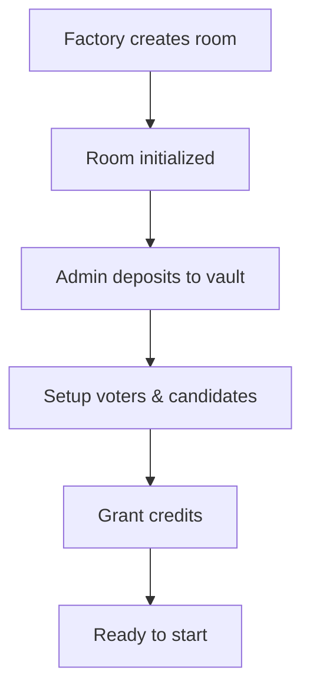

# 🔄 VotingRoom v2 - Complete Lifecycle Guide

## 📋 Table of Contents

1. [State Machine Overview](#state-machine-overview)
2. [Complete Lifecycle Flow](#complete-lifecycle-flow)
3. [State Transitions](#state-transitions)
4. [Function Availability Matrix](#function-availability-matrix)
5. [Multi-Round Scenarios](#multi-round-scenarios)
6. [Best Practices](#best-practices)

---

## 🎯 State Machine Overview

VotingRoom has **4 states** with strict transition rules:

```
┌──────────┐
│ Inactive │ ← Initial state after creation/reset
└────┬─────┘
     │ startVoting()
     ↓
┌──────────┐
│  Active  │ ← Voting is open
└────┬─────┘
     │ endVoting() or stopVoting()
     ↓
┌──────────┐
│  Ended   │ ← Voting stopped, counting results
└────┬─────┘
     │ closeRound()
     ↓
┌──────────┐
│  Closed  │ ← Round finished, results finalized
└────┬─────┘
     │ prepareNextRound() OR resetRoom()
     ↓
┌──────────┐
│ Inactive │ ← Ready for next round
└──────────┘
```

---

## 🔄 Complete Lifecycle Flow

### **Phase 1: Room Creation & Setup** 🏗️

**State:** `Inactive` (Round 0)



**Available Functions:**

```solidity
// 1. Deposit gas budget
sponsorVault.topup{value: 1 ether}(roomAddress);

// 2. Add voters (choose one method)

// Option A: Manual (1 voter at a time)
room.addVoter(voterAddress);
room.grantCredit(voterAddress, 100);

// Option B: Batch (recommended!)
address[] memory voters = [0x123..., 0x456..., 0x789...];
uint256[] memory credits = [100, 150, 100];
room.batchAddVotersWithCredits(voters, credits);

// Option C: Excel upload (frontend handles chunking)
// Uploads 400 voters in 1 transaction!

// 3. Add candidates (choose one)

// Option A: Manual
room.addCandidate(1, "Alice");
room.addCandidate(2, "Bob");

// Option B: Batch
uint256[] memory ids = [1, 2, 3];
string[] memory names = ["Alice", "Bob", "Charlie"];
room.batchAddCandidates(ids, names);
```

**Actions:**
- ✅ Add/remove voters
- ✅ Grant/revoke credits
- ✅ Add/remove candidates
- ✅ Withdraw deposit (if needed)
- ✅ Adjust settings
- ❌ Cannot vote (not Active)
- ❌ Cannot close round (not Ended)

**State Variables:**
```solidity
state = Inactive
currentRound = 0 (or X after prepareNextRound)
totalCreditsGranted = sum of all credits
totalCreditsUsed = 0
```

---

### **Phase 2: Active Voting** 🗳️

**State:** `Active`

**Transition:**
```solidity
// Admin starts voting
room.startVoting();

// Events emitted:
// - RoundStarted(roomAddress, round)
// State changes: Inactive → Active
// currentRound++: 0 → 1
```

**What Happens:**
```
Before startVoting():
├─ state = Inactive
├─ currentRound = 0
└─ Can add voters/candidates

After startVoting():
├─ state = Active
├─ currentRound = 1
├─ roundSummaries[1].startAt = block.timestamp
├─ Registry locked (can't add/remove)
└─ Voting enabled
```

**Available Functions:**

```solidity
// Voters can vote (via relayer in production)
room.vote(candidateId);

// OR for testing (direct call)
room.vote(1); // Vote for candidate #1

// Admin can stop/end voting
room.stopVoting(); // Pause (can't resume)
room.endVoting(); // End round
```

**Actions:**
- ✅ Voters can cast votes
- ✅ Admin can stop/end voting
- ❌ Cannot add/remove voters
- ❌ Cannot add/remove candidates
- ❌ Cannot grant credits
- ❌ Cannot withdraw deposit

**Vote Mechanics:**
```solidity
// When voter votes:
Before vote():
├─ voterCredit[voter] = 100
├─ totalCreditsUsed = 0
├─ roundVotes[1][candidateId] = 0
└─ lastVotedRound[voter] = 0

After vote():
├─ voterCredit[voter] = 0 (ALL credit consumed!)
├─ totalCreditsUsed = 100
├─ roundVotes[1][candidateId] = 100
├─ lastVotedRound[voter] = 1
└─ VoteCast event emitted

Anti-double-vote:
├─ If lastVotedRound[voter] == currentRound
└─ → Revert "AlreadyVotedThisRound"
```

**State Variables:**
```solidity
state = Active
currentRound = 1
totalCreditsGranted = 1000 (unchanged)
totalCreditsUsed = increasing with each vote
roundVotes[1][candidateId] = accumulating
```

---

### **Phase 3: Voting Ended** 🛑

**State:** `Ended`

**Transition:**
```solidity
// Admin ends voting
room.endVoting();

// Events emitted:
// - RoundEnded(roomAddress, round)
// State changes: Active → Ended
```

**What Happens:**
```
After endVoting():
├─ state = Ended
├─ roundSummaries[1].endAt = block.timestamp
├─ No more voting allowed
├─ Admin counts results
└─ Prepare to close round
```

**Available Functions:**

```solidity
// Admin determines winner (off-chain or on-chain count)
// Then closes round:
room.closeRound(winnerId);
```

**Actions:**
- ✅ Admin can close round with winner
- ❌ Cannot vote (voting ended)
- ❌ Cannot add/remove voters
- ❌ Cannot start new round (must close first)

**Counting Results:**
```javascript
// Off-chain (recommended for gas efficiency)
const candidates = [1, 2, 3, 4, 5];
let maxVotes = 0;
let winnerId = 0;

for (const id of candidates) {
  const votes = await room.getVotes(currentRound, id);
  if (votes > maxVotes) {
    maxVotes = votes;
    winnerId = id;
  }
}

// Then close with winner
await room.closeRound(winnerId);
```

**State Variables:**
```solidity
state = Ended
currentRound = 1
totalCreditsGranted = 1000
totalCreditsUsed = 850 (final count)
roundVotes[1][candidate] = final tallies
```

---

### **Phase 4: Round Closed** ✅

**State:** `Closed`

**Transition:**
```solidity
// Admin closes round with winner
room.closeRound(winnerId);

// Events emitted:
// - RoundClosed(roomAddress, round, winnerId, totalWeight)
// State changes: Ended → Closed
```

**What Happens:**
```
After closeRound():
├─ state = Closed
├─ roundSummaries[1].winnerId = winnerId
├─ roundSummaries[1].totalVotesWeight = totalCreditsUsed
├─ roundSummaries[1].closed = true
├─ Round finalized (immutable)
└─ Ready for next round or reset
```

**Available Functions:**

```solidity
// Option A: Continue with SAME voters/candidates
room.prepareNextRound();

// Option B: Start fresh (new voters/candidates)
room.resetRoom();

// Option C: End completely and withdraw
room.withdrawDeposit(amount);
```

**Actions:**
- ✅ Export results
- ✅ Prepare next round
- ✅ Reset room
- ✅ Withdraw deposit
- ❌ Cannot vote
- ❌ Cannot modify voters/candidates (until next phase)

**State Variables:**
```solidity
state = Closed
currentRound = 1
roundSummaries[1] = {
  winnerId: 2,
  totalVotesWeight: 850,
  startAt: 1234567890,
  endAt: 1234568000,
  closed: true
}
```

---

### **Phase 5: Next Round Decision** 🔀

**State:** `Closed` → Choose path

**Two Paths Available:**

#### **Path A: prepareNextRound() - Same Participants** 🔄

**Use Case:** Weekly elections, recurring votes, same voter base

```solidity
room.prepareNextRound();

// What happens:
Before:
├─ state = Closed
├─ currentRound = 1
├─ totalCreditsGranted = 1000
├─ totalCreditsUsed = 850
├─ voterCredit[alice] = 0 (used in round 1)
└─ Voters still eligible ✅

After:
├─ state = Inactive
├─ currentRound = 1 (NOT incremented!)
├─ totalCreditsGranted = 0 (reset counter)
├─ totalCreditsUsed = 0 (reset counter)
├─ voterCredit[alice] = 0 (NOT auto-refilled!)
├─ voterVersion = same (voters still eligible)
└─ candidateVersion = same (candidates still valid)
```

**⚠️ IMPORTANT:**
```solidity
// After prepareNextRound():
// Voters/candidates still registered BUT credits = 0!
// Admin MUST re-grant credits:

room.batchGrantCredits(voters, newCredits);
// Now ready to startVoting() again!
```

**Workflow:**
```
1. closeRound() → state = Closed
2. prepareNextRound() → state = Inactive
3. Admin re-grant credits (same or different amounts)
4. startVoting() → Round 2 begins
5. Same voters vote again
```

---

#### **Path B: resetRoom() - Clean Slate** 🔄

**Use Case:** New election, different voters, major reset

```solidity
room.resetRoom();

// What happens:
Before:
├─ state = Closed
├─ currentRound = 1
├─ Voters: [alice, bob, charlie]
├─ Candidates: [1, 2, 3]
└─ Credits: various

After:
├─ state = Inactive
├─ currentRound = 1 (unchanged)
├─ voterRegistryVersion++ (2)
├─ candidateRegistryVersion++ (2)
├─ totalCreditsGranted = 0
├─ totalCreditsUsed = 0
├─ All previous voters NOT eligible (version mismatch)
├─ All previous candidates NOT valid (version mismatch)
└─ Clean slate!
```

**Registry Version Mechanism:**
```solidity
// Old voters (version 1):
voterVersion[alice] = 1
voterVersion[bob] = 1

// After resetRoom():
voterRegistryVersion = 2

// Eligibility check:
_isVoterEligible(alice):
  return voterVersion[alice] == voterRegistryVersion
  return 1 == 2
  return false ❌

// Must re-add voters:
room.addVoter(alice); // Sets voterVersion[alice] = 2
// Now alice is eligible again ✅
```

**Workflow:**
```
1. closeRound() → state = Closed
2. resetRoom() → state = Inactive, versions++
3. Admin adds NEW voters (or re-add same)
4. Admin adds NEW candidates
5. Admin grants credits
6. startVoting() → Fresh round begins
```

---

## 📊 State Transitions Matrix

| Current State | Function Called | New State | Conditions |
|--------------|----------------|-----------|------------|
| **Inactive** | `startVoting()` | **Active** | - Round setup complete<br>- Voters added<br>- Candidates added<br>- Credits granted |
| **Active** | `stopVoting()` | **Ended** | - Admin only |
| **Active** | `endVoting()` | **Ended** | - Admin only |
| **Ended** | `closeRound(winnerId)` | **Closed** | - Valid winner ID<br>- Admin only |
| **Closed** | `prepareNextRound()` | **Inactive** | - Same voters/candidates<br>- Must re-grant credits |
| **Closed** | `resetRoom()` | **Inactive** | - Clean slate<br>- Must re-add everything |

---

## 🔐 Function Availability Matrix

| Function | Inactive | Active | Ended | Closed |
|----------|----------|--------|-------|--------|
| **Setup Functions** |
| `addVoter()` | ✅ | ❌ | ❌ | ❌ |
| `batchAddVoters()` | ✅ | ❌ | ❌ | ❌ |
| `batchAddVotersWithCredits()` | ✅ | ❌ | ❌ | ❌ |
| `removeVoter()` | ✅ | ❌ | ❌ | ❌ |
| `removeVoterWithRefund()` | ✅ | ❌ | ❌ | ❌ |
| `batchRemoveVoters()` | ✅ | ❌ | ❌ | ❌ |
| `grantCredit()` | ✅ | ❌ | ❌ | ❌ |
| `batchGrantCredits()` | ✅ | ❌ | ❌ | ❌ |
| `addCandidate()` | ✅ | ❌ | ❌ | ❌ |
| `batchAddCandidates()` | ✅ | ❌ | ❌ | ❌ |
| `removeCandidate()` | ✅ | ❌ | ❌ | ❌ |
| `batchRemoveCandidates()` | ✅ | ❌ | ❌ | ❌ |
| **Voting Functions** |
| `startVoting()` | ✅ | ❌ | ❌ | ❌ |
| `vote()` | ❌ | ✅ | ❌ | ❌ |
| `stopVoting()` | ❌ | ✅ | ❌ | ❌ |
| `endVoting()` | ❌ | ✅ | ❌ | ❌ |
| **Round Management** |
| `closeRound()` | ❌ | ❌ | ✅ | ❌ |
| `prepareNextRound()` | ❌ | ❌ | ❌ | ✅ |
| `resetRoom()` | ❌ | ❌ | ❌ | ✅ |
| **Finance** |
| `withdrawDeposit()` | ✅ | ❌ | ✅ | ✅ |
| **View Functions** |
| `getVotes()` | ✅ | ✅ | ✅ | ✅ |
| `getRoundSummary()` | ✅ | ✅ | ✅ | ✅ |
| `isVoterEligible()` | ✅ | ✅ | ✅ | ✅ |

---

## 🎬 Multi-Round Scenarios

### **Scenario 1: Weekly Department Elections**

**Same voters, same candidates, multiple rounds**

```solidity
// Week 1
room.batchAddVotersWithCredits(voters, credits); // 100 students
room.batchAddCandidates(ids, names); // 5 candidates
room.startVoting(); // Round 1
// ... students vote ...
room.endVoting();
room.closeRound(winnerId);

// Week 2 - SAME participants
room.prepareNextRound();
room.batchGrantCredits(voters, newCredits); // Re-grant (can be different amounts!)
room.startVoting(); // Round 2
// ... same students vote again ...
room.endVoting();
room.closeRound(winnerId);

// Week 3 - Continue...
room.prepareNextRound();
// ...repeat
```

**Benefits:**
- ✅ No need to re-add voters/candidates
- ✅ One-time Excel upload
- ✅ Just re-grant credits each week
- ✅ Faster setup

---

### **Scenario 2: Annual University Election**

**Different voters each year**

```solidity
// Year 1
room.batchAddVotersWithCredits(voters2024, credits);
room.batchAddCandidates(candidates2024);
room.startVoting();
// ... voting ...
room.endVoting();
room.closeRound(winnerId);

// Year 2 - NEW students
room.resetRoom(); // Clean slate!
room.batchAddVotersWithCredits(voters2025, credits); // Different students
room.batchAddCandidates(candidates2025); // Different candidates
room.startVoting();
// ... voting ...
```

**Benefits:**
- ✅ Complete reset
- ✅ No leftover data
- ✅ Clear audit trail per year

---

### **Scenario 3: Board Election with Runoff**

**Round 1: Top 2 candidates, Round 2: Final vote**

```solidity
// Round 1 - All candidates
room.batchAddVotersWithCredits(shareholders, credits);
room.batchAddCandidates([1,2,3,4,5], ["A","B","C","D","E"]);
room.startVoting();
// ... voting ...
room.endVoting();
room.closeRound(topCandidate); // Save Round 1 winner

// Determine top 2 candidates off-chain
uint256[] memory top2 = [1, 3]; // Candidates A and C

// Round 2 - Runoff between top 2
room.prepareNextRound();
room.batchRemoveCandidates([2,4,5]); // Remove losers
room.batchGrantCredits(shareholders, credits); // Re-grant
room.startVoting();
// ... final vote between 2 candidates ...
room.endVoting();
room.closeRound(finalWinner);
```

---

### **Scenario 4: Multi-Position Election**

**Different rooms for different positions**

```solidity
// Create 3 rooms
address presidentRoom = factory.createRoom("President");
address vpRoom = factory.createRoom("Vice President");
address treasurerRoom = factory.createRoom("Treasurer");

// Same voters, different candidates per room
for (address room : [presidentRoom, vpRoom, treasurerRoom]) {
  VotingRoom(room).batchAddVotersWithCredits(voters, credits);
  VotingRoom(room).batchAddCandidates(candidatesForPosition);
  VotingRoom(room).startVoting();
}

// Voters can vote in all 3 rooms
// Each room has independent lifecycle
```

---

## 📈 State Timeline Example

**Real-world example: BEM Election**

```
Day 1 (Jan 1, 2026):
├─ 09:00 - Room created (state = Inactive)
├─ 09:30 - Upload 500 voters via Excel
├─ 10:00 - Upload 10 candidates via Excel
├─ 10:30 - Deposit 0.5 ETH to vault
└─ 11:00 - Verify setup complete

Day 2 (Jan 2, 2026):
├─ 08:00 - Admin calls startVoting() (state = Active)
├─ 08:00-18:00 - Voting period (8 hours)
│   ├─ Vote #1: 08:15 - Alice votes
│   ├─ Vote #2: 08:20 - Bob votes
│   ├─ ... 498 more votes ...
│   └─ Vote #500: 17:55 - Last vote
└─ 18:00 - Admin calls endVoting() (state = Ended)

Day 2 (Jan 2, 2026) - continued:
├─ 18:05 - Admin counts votes off-chain
├─ 18:10 - Winner determined: Candidate #3
├─ 18:15 - Admin calls closeRound(3) (state = Closed)
├─ 18:20 - Export results to Excel
└─ 18:30 - Announce winner publicly

Day 3 (Jan 3, 2026) - Optional next round:
├─ Admin calls prepareNextRound() (state = Inactive)
├─ Admin re-grants credits
├─ Admin starts Round 2 for different position
└─ Repeat cycle...
```

---

## ⚠️ Common Pitfalls & Solutions

### **Pitfall 1: Forgetting to Re-Grant Credits**

```solidity
// ❌ WRONG
room.closeRound(winnerId);
room.prepareNextRound();
room.startVoting(); // ERROR! Voters have 0 credit!

// ✅ CORRECT
room.closeRound(winnerId);
room.prepareNextRound();
room.batchGrantCredits(voters, credits); // Re-grant first!
room.startVoting(); // Now OK
```

---

### **Pitfall 2: Using prepareNextRound() When You Need resetRoom()**

```solidity
// Scenario: Want to change voters

// ❌ WRONG
room.prepareNextRound(); // Old voters still eligible!
room.addVoter(newVoter); // Added, but old voters also valid
// Result: Mix of old and new voters ❌

// ✅ CORRECT
room.resetRoom(); // Version++, old voters NOT eligible
room.batchAddVoters(newVoters); // Only new voters
// Result: Clean voter list ✅
```

---

### **Pitfall 3: Trying to Withdraw During Active Voting**

```solidity
// ❌ WRONG
room.startVoting(); // state = Active
room.withdrawDeposit(1 ether); // REVERT! Cannot withdraw during Active

// ✅ CORRECT
room.endVoting(); // state = Ended (or wait for Closed)
room.withdrawDeposit(1 ether); // OK now
```

---

### **Pitfall 4: Not Tracking Round Numbers**

```solidity
// After multiple rounds:
currentRound = 5

// ❌ WRONG - Checking wrong round
votes = room.getVotes(1, candidateId); // Round 1 data (old!)

// ✅ CORRECT - Check current round
currentRound = room.currentRound();
votes = room.getVotes(currentRound, candidateId); // Current round
```

---

## 🎯 Best Practices

### **1. Always Check State Before Actions**

```javascript
const state = await room.state();
const stateNames = ['Inactive', 'Active', 'Ended', 'Closed'];

console.log(`Current state: ${stateNames[state]}`);

if (state !== 0) { // 0 = Inactive
  alert('Cannot add voters. Room must be Inactive');
  return;
}

await room.addVoter(address);
```

---

### **2. Use Batch Functions for Large Operations**

```javascript
// ❌ BAD - 100 transactions
for (const voter of voters) {
  await room.addVoter(voter.address);
  await room.grantCredit(voter.address, 100);
}

// ✅ GOOD - 1 transaction
await room.batchAddVotersWithCredits(
  voters.map(v => v.address),
  voters.map(v => 100)
);
```

---

### **3. Track Round History**

```javascript
// Store round summaries off-chain
const currentRound = await room.currentRound();

for (let i = 1; i <= currentRound; i++) {
  const summary = await room.getRoundSummary(i);
  
  await supabase.from('round_history').insert({
    room_address: roomAddress,
    round: i,
    winner_id: summary.winnerId,
    total_weight: summary.totalVotesWeight.toString(),
    started_at: new Date(summary.startAt * 1000),
    ended_at: new Date(summary.endAt * 1000)
  });
}
```

---

### **4. Validate Before State Transitions**

```javascript
// Before startVoting()
const voterCount = await getVoterCount(); // From Supabase or events
const candidateCount = await getCandidateCount();
const totalCredits = await room.totalCreditsGranted();

if (voterCount === 0) {
  throw new Error('No voters added!');
}

if (candidateCount < 2) {
  throw new Error('Need at least 2 candidates!');
}

if (totalCredits === 0) {
  throw new Error('No credits granted!');
}

// OK to start
await room.startVoting();
```

---

### **5. Monitor Gas Budget**

```javascript
// Check vault balance before starting
const balance = await sponsorVault.roomBalance(roomAddress);
const estimatedCost = voterCount * avgGasPerVote;

if (balance < estimatedCost) {
  alert(`Insufficient balance! Need ${estimatedCost} wei, have ${balance} wei`);
  // Top up
  await sponsorVault.topup(roomAddress, { value: additionalAmount });
}
```

---

## 📋 Complete Lifecycle Checklist

### **Room Setup**
- [ ] Create room via factory
- [ ] Deposit gas budget to vault
- [ ] Upload voters (Excel or manual)
- [ ] Upload candidates (Excel or manual)
- [ ] Verify all data correct
- [ ] Verify state = Inactive

### **Start Voting**
- [ ] Verify voterCount > 0
- [ ] Verify candidateCount >= 2
- [ ] Verify totalCreditsGranted > 0
- [ ] Verify vault balance sufficient
- [ ] Call startVoting()
- [ ] Verify state = Active

### **During Voting**
- [ ] Monitor vote count
- [ ] Monitor vault balance
- [ ] Track voter participation
- [ ] Handle voter questions

### **End Voting**
- [ ] Wait for voting period
- [ ] Call endVoting()
- [ ] Verify state = Ended
- [ ] Count votes (on-chain or off-chain)

### **Close Round**
- [ ] Determine winner
- [ ] Call closeRound(winnerId)
- [ ] Verify state = Closed
- [ ] Export results
- [ ] Announce winner

### **Next Round (Optional)**
- [ ] Decide: prepareNextRound() or resetRoom()?
- [ ] If prepare: Re-grant credits
- [ ] If reset: Re-add voters/candidates
- [ ] Verify state = Inactive
- [ ] Repeat cycle

---

## 🚀 Quick Reference

| Task | Function | State Required |
|------|----------|----------------|
| Add voters | `batchAddVotersWithCredits()` | Inactive |
| Add candidates | `batchAddCandidates()` | Inactive |
| Start voting | `startVoting()` | Inactive |
| Cast vote | `vote(candidateId)` | Active |
| End voting | `endVoting()` | Active |
| Close round | `closeRound(winnerId)` | Ended |
| Next round (same) | `prepareNextRound()` | Closed |
| Next round (new) | `resetRoom()` | Closed |
| Withdraw | `withdrawDeposit(amount)` | Not Active |

---

## 📚 Related Documentation

- [Implementation Guide](./IMPLEMENTATION_GUIDE.md)
- [Excel Templates](../templates/EXCEL_TEMPLATES_README.md)
- [Quick Start](./QUICK_START.md)
- [Contract Functions Reference](./FUNCTIONS_REFERENCE.md)

---

**Last Updated:** January 20, 2026  
**Version:** v2.0
